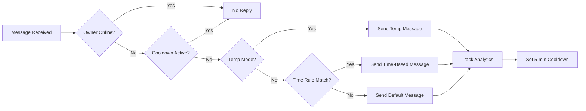

<div align="center">

# 🤖 Smart Telegram Userbot

### Intelligent Auto-Reply System with Time-Based Scheduling

[](https://www.python.org/downloads/)
[](https://www.mongodb.com/)
[](https://github.com/LonamiWebs/Telethon)
[](https://pypi.org/project/pytz/)
[](LICENSE)


*Never miss a message. Let your userbot handle replies intelligently while you're away.*

[Features](#-features) • [Quick Start](#-quick-start) • [Commands](#-command-reference) • [Examples](#-usage-examples)

</div>

---

## 🎯 What This Does

This userbot monitors your Telegram account and automatically sends contextual replies when you're offline. Unlike basic auto-responders, it:

- 🕐 **Switches messages based on time** (e.g., "working" during office hours, "sleeping" at night)
- 🧠 **Detects your real status** (only replies when you're actually offline)
- 📊 **Tracks analytics** (see who messaged you and when)
- 🛡️ **Stays secure** (commands only work in your Saved Messages)
- ⏱️ **Prevents spam** (5-minute cooldown per user)
- 🌍 **IST Timezone Support** (powered by pytz for accurate time handling)

## ✨ Features

<table>
<tr>
<td width="50%">

### 🎭 Smart Auto-Reply
- 17 predefined message categories
- Custom message support
- Human-like responses
- Cooldown system to prevent spam

</td>
<td width="50%">

### ⏰ Time-Based Automation
- Schedule messages by time (IST)
- Multiple time slots per category
- Temporary override mode
- Enable/disable on demand
- **Powered by pytz** for accurate timezone handling

</td>
</tr>
<tr>
<td>

### 📈 Analytics Dashboard
- Daily message statistics
- Weekly summaries
- User tracking
- Reply history

</td>
<td>

### 🔐 Security First
- Owner-only commands
- Saved Messages isolation
- Confirmation for destructive actions
- Auto-expiring confirmations

</td>
</tr>
</table>

## 🚀 Quick Start

### Prerequisites

```bash
✓ Python 3.8 or higher
✓ MongoDB (local or Atlas)
✓ Telegram account
✓ API credentials from https://my.telegram.org
```

### Installation

**1. Clone & Install**
```bash
git clone https://github.com/projectstackofficial/telegram-userbot.git
cd telegram-userbot
pip install -r requirements.txt
```

**2. Configure**
```bash
cp .env.example .env
nano .env  # Add your credentials
```

**3. Run**
```bash
python main.py
```

**4. First Login**
- Enter your phone number
- Enter verification code
- Enter 2FA password (if enabled)

**5. Open Saved Messages**
```
Type: /start
```

Done! 🎉

## 📱 Command Reference

### Essential Commands

| Command | Description | Example |
|---------|-------------|---------|
| `/on` | Enable auto-reply | - |
| `/off` | Disable auto-reply | - |
| `/set <msg>` | Change default message | `/set Out for lunch!` |
| `/status` | Check your status | - |
| `/help` | Full command list | - |

### Time-Based Rules

| Command | Description | Example |
|---------|-------------|---------|
| `/custom <time> <category>` | Add time rule | `/custom 09:00-17:00 work` |
| `/listcustom` | View all rules | - |
| `/customedit <id> <time>` | Edit rule time | `/customedit abc123 08:30-17:30` |
| `/removecustom <id\|category>` | Delete rule(s) | `/removecustom work` |
| `/customon` | Enable time rules | - |
| `/customoff` | Disable time rules | - |

### Temporary Mode

| Command | Description | Example |
|---------|-------------|---------|
| `/temp <category>` | Quick activate | `/temp lunch` |
| `/listtemp` | Check temp status | - |
| `/tempreset` | Restore saved rules | - |

### Analytics

| Command | Description |
|---------|-------------|
| `/stats today` | Today's statistics |
| `/stats week` | Last 7 days |

### Categories

| Command | Description |
|---------|-------------|
| `/categories` | View all available categories |

## 💡 Usage Examples

### Example 1: Simple Auto-Reply

```
/on
/set Hey! I'm busy right now. Will reply ASAP 🙏
```

### Example 2: Work Schedule

```
/custom 09:00-17:00 work
/custom 13:00-14:00 lunch
/customon
/on
```
Now your message automatically changes:
- 9 AM - 1 PM: "I'm working right now..."
- 1 PM - 2 PM: "I'm having lunch..."
- 2 PM - 5 PM: "I'm working right now..."
- Other times: Default message

### Example 3: Quick Temporary Change

```
/temp gym
```
Instantly switches to gym message. Restore later:
```
/tempreset
```

### Example 4: Split Shifts

```
/custom 09:00-13:00 work
/custom 15:00-19:00 work
/custom 21:00-23:00 work
```
Multiple time slots for the same category!

## 📋 Available Categories

<details>
<summary><b>Click to expand all 17 categories</b></summary>

### 🔵 General Status
- `away` - "Hey! I'm currently away from my phone. I'll get back to you soon 😊"
- `busy` - "I'm a bit busy right now, but I'll reply as soon as I can 🙏"
- `offline` - "I'm offline at the moment. Will catch up with you later!"

### 💼 Work & Productivity
- `work` - "I'm working right now. I'll respond once I'm free ⚡"
- `study` - "I'm studying at the moment. Will get back to you later 📚"
- `meetings` - "I'm in meetings right now. I'll reply as soon as they're done!"
- `focus` - "I'm in deep focus mode. Will respond when I'm done 🎯"
- `dnd` - "Please don't disturb right now. I'll get back to you soon!"

### 🏠 Personal Activities
- `sleep` - "I'm sleeping right now. I'll reply when I wake up 😴"
- `lunch` - "I'm having lunch. Will get back to you shortly!"
- `gym` - "I'm at the gym right now. Will reply once I'm done 💪"
- `fresh` - "I'm freshening up. Will respond in a bit!"

### ✈️ Travel & Movement
- `driving` - "I'm driving at the moment. I'll text you once I'm parked 🚗"
- `travel` - "I'm traveling right now. Will reply when I can!"
- `family` - "I'm spending time with family. Will catch up with you later 🏡"
- `vacation` - "I'm on vacation! I'll reply when I get a chance 🌴"

</details>

## 🔄 How It Works



## 🗂️ Project Structure

```
telegram-userbot/
│
├── 📄 main.py                  # Application entry point - starts the userbot
├── 🤖 userbot.py               # Core bot logic, command handlers & auto-reply system
├── 💾 database.py              # MongoDB connection & database operations
├── 📦 models.py                # Data models (TimeRule, BotState, TempState, etc.)
├── 📋 categories.py            # Predefined message categories (17 categories)
├── ⚙️ config.py                # Configuration loader from environment variables
├── 🛠️ utils.py                 # Helper functions (IST timezone via pytz, time parsing)
│
├── 📝 requirements.txt         # Python dependencies (telethon, pymongo, pytz, etc.)
├── 🔒 .env.example             # Environment variables template
├── 🚫 .gitignore               # Git ignore rules (excludes .env, session files, logs)
└── 📖 README.md                # Project documentation (this file)
```

### File Descriptions

| File | Lines | Description |
|------|-------|-------------|
| `main.py` | ~78 | Entry point that initializes database, creates userbot instance, and handles startup/shutdown |
| `userbot.py` | ~1482 | Main userbot class with all command handlers, auto-reply logic, and event management |
| `database.py` | ~450 | MongoDB wrapper with methods for state, rules, analytics, and confirmations |
| `models.py` | ~200 | Dataclasses for TimeRule, BotState, TempState, PendingConfirmation |
| `categories.py` | ~108 | Dictionary of 17 predefined categories with human-like messages |
| `config.py` | ~120 | Loads environment variables and defines constants (cooldown, intervals) |
| `utils.py` | ~180 | Utility functions for IST time handling, parsing, and validation |
| `requirements.txt` | ~10 | Lists all Python package dependencies |
| `.env.example` | ~16 | Template for environment configuration |
| `.gitignore` | ~15 | Specifies files to exclude from version control |

## ⚙️ Configuration

Create a `.env` file:

```env
# Get from https://my.telegram.org
API_ID=12345678
API_HASH=0123456789abcdef0123456789abcdef

# MongoDB (local or cloud)
MONGO_URI=mongodb://localhost:27017/
DB_NAME=telegram_userbot

# Session name
SESSION_NAME=userbot_session

# Default message (optional)
DEFAULT_MESSAGE=Hey! I'm currently away. I'll get back to you soon 😊
```

## 🛠️ Tech Stack

<div align="center">

| Technology | Purpose | Version |
|------------|---------|---------|
| **[Telethon](https://github.com/LonamiWebs/Telethon)** | Telegram client library | 1.34+ |
| **[MongoDB](https://www.mongodb.com/)** | Database for persistence | 4.0+ |
| **[PyMongo](https://pymongo.readthedocs.io/)** | MongoDB driver | 4.6+ |
| **[pytz](https://pythonhosted.org/pytz/)** 🌍 | IST Timezone support | 2024.1+ |
| **[python-dotenv](https://github.com/theskumar/python-dotenv)** | Environment management | 1.0+ |

</div>

### Why pytz?

The userbot uses **pytz** for accurate Indian Standard Time (IST) handling:
- ✅ Precise timezone conversions
- ✅ Handles daylight saving time transitions
- ✅ Reliable datetime operations
- ✅ Industry-standard timezone library

All time-based features (custom rules, analytics, timestamps) use IST via pytz.

## 📊 Database Schema

```javascript
// Collections
{
  bot_state: {
    owner_id: int,
    auto_reply_enabled: bool,
    custom_rules_enabled: bool,
    default_message: str
  },
  
  time_rules: {
    rule_id: str,
    owner_id: int,
    start_time: str,      // "HH:MM" in IST
    end_time: str,        // "HH:MM" in IST
    category: str
  },
  
  temp_state: {
    owner_id: int,
    temp_category: str,
    is_active: bool,
    saved_rules: []
  },
  
  analytics: {
    owner_id: int,
    user_id: int,
    timestamp: datetime,
    message_sent: str,
    ist_date: str,        // IST date via pytz
    ist_time: str         // IST time via pytz
  }
}
```

## 🔒 Security Features

- ✅ Commands only work in Saved Messages
- ✅ Owner verification for all actions
- ✅ Confirmation required for destructive operations
- ✅ Auto-expiring confirmations (60 seconds)
- ✅ No command execution from other users
- ✅ `.gitignore` protects sensitive files (.env, session files)

## 🐛 Troubleshooting

<details>
<summary><b>Database connection failed</b></summary>

```bash
# Check if MongoDB is running
mongod --version
sudo systemctl status mongod

# Verify connection string in .env
MONGO_URI=mongodb://localhost:27017/
```
</details>

<details>
<summary><b>Commands not responding</b></summary>

- Ensure you're in **Saved Messages** (not regular chats)
- Commands must start with `/`
- Check `userbot.log` for errors
</details>

<details>
<summary><b>Auto-reply not working</b></summary>

```
/status    # Check if enabled
/on        # Enable if disabled
```

Make sure you're actually offline on Telegram!
</details>

<details>
<summary><b>Timezone issues</b></summary>

All times are in IST (Indian Standard Time) thanks to pytz:
```python
# Time is automatically converted to IST
# Example: 09:00 means 9:00 AM IST
```
</details>

<details>
<summary><b>Import errors</b></summary>

```bash
pip install -r requirements.txt --upgrade
```
</details>

<details>
<summary><b>Missing .env file</b></summary>

```bash
# Copy the example file
cp .env.example .env

# Then edit with your credentials
nano .env
```
</details>

## 📈 Statistics Example

```
/stats today

📊 Today's Statistics (Feb 15, 2026)
━━━━━━━━━━━━━━━━━━━━━━━━━━━━━
📨 Total Messages: 47
✅ Auto-Replies Sent: 23
👥 Unique Users: 15

🔝 Top Messagers:
1. John Doe - 8 messages
2. Jane Smith - 5 messages
3. Alex Johnson - 4 messages

⏰ Hourly Breakdown (IST):
09:00-10:00: ████████ 8
10:00-11:00: ██████ 6
11:00-12:00: █████ 5
```

## ⚠️ Important Notes

> **This is a userbot, not a bot.** It runs on your personal Telegram account.

- ✓ Use responsibly and follow Telegram's ToS
- ✓ Don't spam or auto-reply to everyone excessively
- ✓ Keep your API credentials secure
- ✓ Enable 2FA on your Telegram account
- ✓ Never commit your `.env` file to version control
- ⚠️ The developers are not responsible for account bans

## 🤝 Contributing

Contributions welcome! Feel free to:

1. 🍴 Fork the repository
2. 🌿 Create a feature branch
3. ✨ Make your changes
4. 📫 Submit a pull request

## 📝 Changelog

### v1.0.0 (Current)
- ✅ Time-based auto-switching (IST via pytz)
- ✅ 17 predefined categories
- ✅ Custom time rules
- ✅ Temporary reply mode
- ✅ Message analytics with IST tracking
- ✅ Confirmation system
- ✅ MongoDB persistence
- ✅ Complete project documentation

## 📄 License

This project is provided as-is for educational and personal use.

## 🙏 Credits

Built with ❤️ using:
- [Telethon](https://github.com/LonamiWebs/Telethon) by Lonami
- [MongoDB](https://www.mongodb.com/)
- [pytz](https://pythonhosted.org/pytz/) for timezone magic 🌍
- [Python](https://www.python.org/)

## 📞 Support

- 📖 Check the [troubleshooting section](#-troubleshooting)
- 📋 Review `userbot.log` for errors
- 🐛 Open an issue on GitHub
- 💬 Read `/help` in Saved Messages

---

<div align="center">

**Made with 🤖 for Telegram Power Users**

⭐ Star this repo if you find it useful!

[Report Bug](https://github.com/projectstackofficial/telegram-userbot/issues) • [Request Feature](https://github.com/projectstackofficial/telegram-userbot/issues)

</div>
